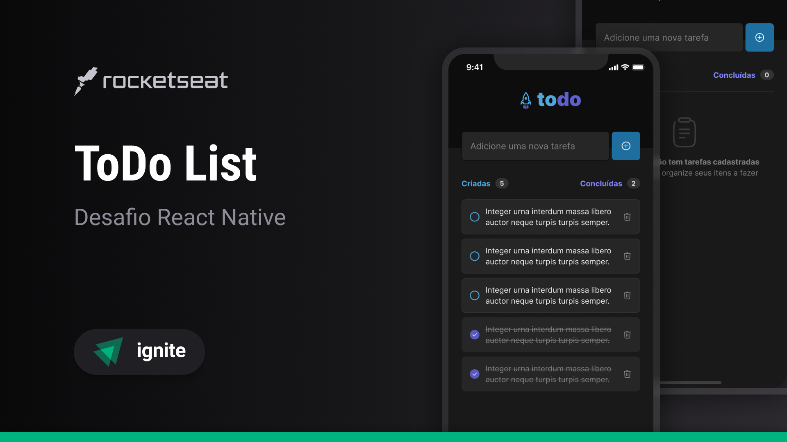

<h1 align="center">
    
</h1>

<p align="center">
  

  
  
  <a href="https://github.com/joao0pedro0alves/rocketseat-challenges-todolist/commits/master">
    
  </a>
    
   

   <a href="https://github.com/joao0pedro0alves/rocketseat-challenges-todolist/stargazers">
    
  </a>
</p>

<p>
  
</p>

<h4 align="center"> 
	Concluído
</h4>

<p align="center">
 <a href="#-about">About</a> |
 <a href="#-technologies">Technologies</a> | 
 <a href="#-author">Author</a> | 
</p>


## 💻 About

A aplicação "Todo List" foi desenvolvida com o objetivo de consolidar os conceitos fundamentais do React Native. A interface foi construída exclusivamente com os recursos nativos do React Native, sem recorrer a bibliotecas externas de estilização, como o styled-components. Para o gerenciamento de estado, foi utilizada a Context API, garantindo uma abordagem eficiente e simples para o controle de dados no aplicativo.

---

## ⚙️ Funcionalidades

- [x] Adicionar uma nova tarefa
- [x] Marcar e desmarcar uma tarefa como concluída
- [x] Remover uma tarefa da listagem
- [x] Mostrar o progresso de conclusão das tarefas
 
---

### Pré-requisitos

Antes de baixar o projeto você vai precisar ter instalado na sua máquina as seguintes ferramentas:

* [Git](https://git-scm.com)
* [NodeJS](https://nodejs.org/en/)
* [Yarn](https://yarnpkg.com/) ou [NPM](https://www.npmjs.com/)

Além disto é bom ter um editor para trabalhar com o código como [VSCode](https://code.visualstudio.com/)

#### 🧭 Rodando a aplicação

```bash
# Instale as dependências
$ npm install

# Execute a aplicação em modo de desenvolvimento
$ npm run start
```
---

## 🛠 Technologies

As seguintes ferramentas foram usadas na construção do projeto:

#### **Website**  ([Expo](https://expo.dev/)  +  [TypeScript](https://www.typescriptlang.org/))

> Veja o arquivo  [package.json](https://github.com/joao0pedro0alves/rocketseat-challenges-todolist/blob/main/web/package.json)

## 🦸 Author

<a href="https://github.com/joao0pedro0alves">
 
 <br />
 <br />
 <sub><strong>João Alves</strong> 🚀</sub>
</a>

<br />
<br />

<a href="https://instagram.com/joaao_alvees" target="_blank"></a>
<a href = "mailto:contato@joao.alves1032003@gmail.com"></a>
<a href="https://www.linkedin.com/in/jo%C3%A3o-pedro-alves-pereira-bb0052216/" target="_blank"></a>


Feito com 💜 por João Alves 👋🏽 [Entre em contato!](https://www.linkedin.com/in/jo%C3%A3o-pedro-alves-pereira-bb0052216/)

---
